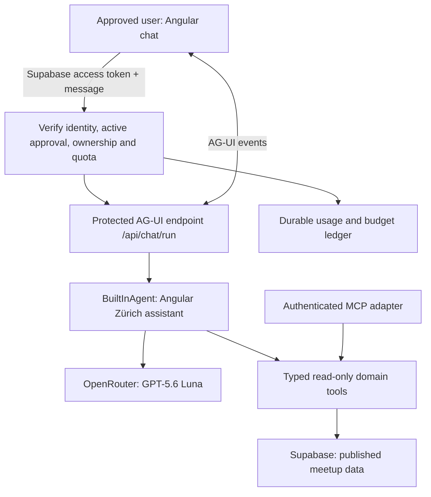

# Angular Zürich chatbot implementation plan

Updated: 17 September 2026. Initial implementation is in the repository; hosted deployment and a paid-model smoke test are pending. See [chat setup](chatbot-setup.md).

## Recommendation

Use **native Angular chat controls + AG-UI + Copilot Runtime’s built-in agent and server tools**, with **GPT-5.6 Luna through OpenRouter**, hosted in the **existing Vercel Node/Express deployment**. Keep Supabase for identity, data and usage accounting. **Mastra is optional and deferred** until workflows or richer agent observability justify it.

These components have different responsibilities:

| Component                      | Responsibility                                                                                  |
| ------------------------------ | ----------------------------------------------------------------------------------------------- |
| Native Angular + AG-UI client  | Lazy chat UI, conversation state, cancellation and typed source cards                           |
| AG-UI                          | Events connecting the frontend to the backend                                                   |
| Copilot Runtime + BuiltInAgent | HTTP integration, model/tool execution and a place to enforce authentication and request policy |
| Mastra (optional later)        | More advanced agent workflows, memory and execution observability                               |
| MCP                            | A standard interface for exposing the application’s bounded tools                               |
| Supabase                       | Existing identity, approval checks, meetup data and durable usage accounting                    |
| OpenRouter                     | Server-side access to the selected model                                                        |

CopilotKit’s current Angular package targets Angular 22, matching this application. Its built-in agent supports server-executed tools through `defineTool`, so the initial searches do not require Mastra. See the [Angular reference](https://docs.copilotkit.ai/reference/angular) and [server tools documentation](https://docs.copilotkit.ai/server-tools).

OpenRouter provides model inference. Our backend must still verify approved users, enforce quotas, execute database searches and return tool results to the model. OpenRouter does not automatically execute our application’s tools or gain database access. See [OpenRouter tool calling](https://openrouter.ai/docs/guides/features/tool-calling).

Implementation finding: CopilotKit Angular’s root provider pulled approximately 10 MB of development JavaScript into the initial bundle. The implementation therefore uses native Angular controls and the AG-UI client, while retaining CopilotKit’s BuiltInAgent on the server. This keeps the chat UI lazy and preserves the shared agent protocol. Use one built-in conversational agent and shared typed domain handlers for the initial release. MCP provides interoperability for those handlers; ordinary model tool calling does not itself require MCP.

The self-hosted framework code does not require a hosted CopilotKit or Mastra subscription. CopilotKit is MIT-licensed, and Mastra lists its Apache 2.0 framework as free to self-host. Model inference and hosting usage are separate costs. See the [CopilotKit license](https://github.com/CopilotKit/CopilotKit/blob/main/LICENSE) and [Mastra pricing](https://mastra.ai/pricing).

## What the supplied examples establish

- `tmp/ag-ui-packt-intro-main`: a working Angular 22/CopilotKit frontend connected directly to a hand-written AG-UI server and Gemma through llama.cpp. Useful references are `apps/web/src/app/examples/copilot-page.ts`, `apps/web/src/app/app.config.ts`, and the server’s streaming/cancellation code. It is not a Mastra implementation. Its README pins CopilotKit Angular 0.5.2 and AG-UI 0.0.59, and documents missing protobuf event support in that version. Prefer SSE for this project.
- `tmp/packt-agentic-frontends-workshop-main`: useful typed tools, MCP schemas and structured results, correlation IDs, and bounded application authority. The checked snapshot’s `apps/coordinator-service/src/app.ts` uses a `BuiltInAgent` with `openai/gpt-4o-mini`; `mastra-tools.ts` defines tools, but this is not the full Mastra conversational implementation described in `docs/step-04-mastra-agent.md`. That document refers to a separate checkpoint branch and different dependency pins. Its Angular main snapshot uses the workshop client rather than the prebuilt CopilotKit chat. Do not treat the documents and this snapshot as interchangeable implementations.
- `tmp/agentic-frontends-webinar.pdf`: the 70-page deck separates component responsibilities on page 8 and shows the CopilotKit → Mastra → OpenRouter architecture on pages 24–28. Pages 31–33 explain bounded frontend context; page 65 keeps authorization in the application. Borrow these boundaries. Generated SQL, A2A specialists, generated HTML and MCP Apps are unnecessary for the first release.

The examples are teaching material. Their permissive CORS, demonstration identity, client-supplied conversation data and in-memory state need production-specific handling.

## Existing application fit

- Angular 22.1, TypeScript 6, signals, lazy feature routes, Supabase JS and Express are already installed.
- `src/server.ts`, `api/index.js` and `vercel.json` provide a Node/Express deployment path on Vercel. Mount the runtime before Angular’s catch-all renderer and verify the existing Vercel rewrite preserves runtime subroutes.
- `AuthService` already manages Google/Supabase sessions. Authentication hooks use `private.allowed_google_accounts`, including its `active` flag. **Retain approved-account-only sign-in. Do not introduce public member registration.**
- `organizerAuthGuard` checks whether there is a session; it does not independently recheck the approval table. A chat-specific access check is still needed.
- `Talks`, `SpeakerOnTalk`, `People`, `Events` and `Venues` already support the requested queries. Talks contain descriptions and slide links. Multiple speakers per talk must be preserved.
- Existing RLS distinguishes published data from private organizer data, and column grants protect speaker email addresses. Approved organizers can see private records elsewhere; the chatbot should still be explicitly restricted to published content in its first release.
- The design brief and `getPastEvents()` restrict the browsable archive before **1 February 2026** because older data is incomplete. **The chatbot must search all stored published talks, including earlier talks; do not reuse that UI date cutoff.** Describe incomplete historical coverage when relevant, without hiding available older records.

## Proposed request flow



The backend is required, but a separate server, hosting provider or subscription is not. Mount the runtime and built-in agent in the existing Vercel Node/Express deployment. Keep server modules separate from browser imports. A deployment spike must verify CopilotKit/AG-UI/provider package compatibility, Vercel streaming, disconnect cancellation, runtime duration and bundle size. Only consider another deployment target if measured limits or compatibility issues require it.

Do not assume an in-memory runner provides durable conversations, cross-instance locks, or reliable cross-instance cancellation. Keep the initial run attached to its request and propagate disconnects. If the selected runner requires affinity or durable storage, resolve that during the spike before deployment. Persistent threads, if enabled, belong to a user and use durable storage; local SQLite files are unsuitable as persistent Vercel storage.

## Hosting options and decision

Prices and allowances below were checked on 17 September 2026. They describe backend hosting, excluding model inference and existing database costs. Account eligibility, other application usage and deployment settings still need checking; no paid plan or spending amount is authorized by this plan.

| Option                                | Free or inexpensive allowance                                                                                                                                           | Fit and tradeoff                                                                                                                                                                                                                                    |
| ------------------------------------- | ----------------------------------------------------------------------------------------------------------------------------------------------------------------------- | --------------------------------------------------------------------------------------------------------------------------------------------------------------------------------------------------------------------------------------------------- |
| Existing Vercel deployment — selected | Potentially $0 additional within the current plan’s allowances; Hobby includes 1 million invocations, 4 active CPU hours and 360 GB-hours of provisioned memory monthly | Reuses the current Node/Express setup. Hobby is restricted to personal, non-commercial use; do not assume this project qualifies or that its current plan has spare capacity.                                                                       |
| Supabase Edge Function                | Free tier includes 500,000 invocations/month; paid-plan overage is $2 per million beyond the included quota                                                             | Good alternative for a lightweight backend alongside the existing database. Free functions have 150 seconds wall-clock duration and 2 seconds CPU time per request. Deno/package compatibility must be tested before moving the selected runtime.   |
| Cloudflare Workers                    | Free tier includes 100,000 requests/day; paid starts at $5/month with usage allowances and overages                                                                     | An inexpensive separate backend option, but adds a deployment platform. The free tier’s 10 ms CPU allowance is tight for authentication and a full agent stack; test compatibility and CPU consumption. Network waiting does not count as CPU time. |
| Mastra Cloud — optional later         | Starter currently lists $0/month with 24 CPU hours and 100,000 observability events included, then overages                                                             | Consider only if adopting Mastra and wanting managed agent hosting/traces. It is not required to use the Mastra library, which can also run in the existing backend.                                                                                |

Sources: [Vercel function pricing](https://vercel.com/docs/functions/usage-and-pricing), [Vercel Hobby eligibility](https://vercel.com/docs/plans/hobby), [Supabase function pricing](https://supabase.com/docs/guides/functions/pricing), [Supabase limits](https://supabase.com/docs/guides/functions/limits), [Cloudflare pricing](https://developers.cloudflare.com/workers/platform/pricing/), [Workers limits](https://developers.cloudflare.com/workers/platform/limits/), [Mastra pricing](https://mastra.ai/pricing).

Prefer existing Vercel capacity over another service for the first release. If the existing plan cannot accommodate the chat, compare a lightweight Supabase function with paid Cloudflare Workers after the compatibility spike. Moving frameworks or hosts must preserve the same authorization, quotas and tool boundaries. Free hosting does not make GPT-5.6 Luna inference free.

## Approved-user access and spending controls

For every runtime request, including discovery and any thread endpoints:

1. Verify the Supabase bearer token server-side, using `auth.getUser(token)` or a verified-claims implementation with equivalent checks. Reject missing, expired or invalid credentials before any model call.
2. Check the existing active account approval against the database. Derive identity from the verified session, never a supplied email, user ID, frontend property or user-editable metadata. A small authorization RPC can follow the existing private authorization function/public wrapper convention and return only a boolean.
3. Reject a deactivated account even if its token has not expired. Recheck before model steps in longer runs. Retain the existing Google-account restrictions rather than silently changing them.
4. Bind run ownership to the authenticated user. The initial implementation has no server-side thread storage, replay, or resume endpoint; thread IDs are transport identifiers only. Ignore client attempts to choose another resource owner, agent, system prompt, model or tool implementation.
5. Atomically reserve request capacity and estimated maximum cost in durable storage. The initial implementation conservatively retains a 10-cent reservation per accepted run, including errors/cancellations; actual-cost reconciliation is deferred. Use expiring reservations and idempotency keys so retries, crashes and simultaneous tabs do not bypass the cap. Fail closed if budget accounting is unavailable.

Suggested **configurable starting limits**, to tune during the pilot:

| Limit           | Initial proposal                                                                                      |
| --------------- | ----------------------------------------------------------------------------------------------------- |
| Concurrent runs | 1 per user                                                                                            |
| Burst           | 5 messages per minute per user                                                                        |
| Daily allowance | 30 messages per user                                                                                  |
| Input           | 2,000 characters per message; bounded total request/history                                           |
| Execution       | 3 model calls, at most 8 archive calls, 90-second run deadline                                        |
| Model context   | 40,000 serialized request bytes per model call                                                        |
| Output          | 800 billed completion tokens per step, including reasoning where applicable                           |
| Tool results    | 10 results per call, at most 800 description characters per record                                    |
| Shared spending | Configurable daily reservation cap (default $2) and kill switch; OpenRouter key cap for overall spend |

Limits must count classification, tool follow-ups, retries and reasoning usage. Enforce an overall run budget as well as individual call limits. No automatic upgrade to a more expensive model. Stop the upstream request when the user cancels; already-generated tokens can still be billable. Add an OpenRouter key-level spending limit as a second control and verify its configured behavior.

Keep `OPENROUTER_API_KEY` exclusively in server secrets, outside Angular environment injection. Disable automatic model-generated greetings/suggestions; opening a chat should cost zero model tokens. Store only run IDs, user IDs, timestamps and reserved cents in the initial ledger. Prompts, tool data, actual token usage and transcripts are not persisted. Add redacted usage telemetry and reconciliation in a later iteration.

Supabase’s [getUser documentation](https://supabase.com/docs/reference/javascript/auth-getuser) covers server verification; CopilotKit’s [Angular authentication guide](https://docs.copilotkit.ai/angular/strands/auth) covers session headers and runtime hooks. The SDK does not configure this application’s approval policy automatically.

## Tool catalogue and MCP design

Create **one Angular Zürich MCP server with a small, coherent tool catalogue**. Many individual MCP servers would add unnecessary deployment and credential management.

| Tool                   | Inputs                                                          | Result / example                                                                               |
| ---------------------- | --------------------------------------------------------------- | ---------------------------------------------------------------------------------------------- |
| `search_talks`         | query, optional speaker ID, event ID, date range, cursor, limit | Ranked title/description matches: “Who gave a talk about signals?”                             |
| `find_speakers`        | name query, limit                                               | Speaker IDs and public names; ask for clarification for ambiguous names                        |
| `get_talks_by_speaker` | speaker ID, cursor, limit                                       | All matching published talks through pagination                                                |
| `list_events`          | past/upcoming, optional title/date filters, cursor, limit       | Resolve an event by name or time                                                               |
| `get_event`            | event ID or validated slug                                      | Public venue, date, agenda and talk IDs                                                        |
| `get_talks_by_event`   | event ID, cursor, limit                                         | Published agenda in presentation order                                                         |
| `get_talk`             | talk ID                                                         | Full bounded description, all speakers, event and available slides                             |
| `get_community_info`   | allowed topic enum                                              | Curated, versioned information about the meetup, organizers, participation and talk submission |

`get_community_info` should use explicitly maintained content with source URLs, not arbitrary website crawling. Add tools only when a real question requires them; the model receives the small relevant catalogue.

Implement schemas and domain handlers once. Register the same handlers as CopilotKit built-in agent server tools (`defineTool`) and through an actual MCP adapter (`tools/list`, `tools/call`, structured content and read-only annotations). The in-process agent may call the handlers directly to avoid a self-HTTP request. MCP consumers use the adapter; protocol support does not require an extra network hop for every local call. Verify both registrations against the same contract tests. Keep domain handlers independent of CopilotKit so they can also be registered with Mastra later without rewriting retrieval or authorization.

MCP access must enforce identity/approval and tool bounds too; it must not become a bypass around the runtime. Start with internal use and a protected adapter. Supporting external clients later requires an explicit token audience/scopes design and, where appropriate, MCP authorization discovery/OAuth. Do not accept arbitrary remote MCP URLs or expose Supabase’s administrative MCP server to this agent. Tool annotations describe behavior; handlers enforce it.

Each tool returns stable IDs, bounded data, a result count, pagination metadata and sources. Source URLs come from trusted event slugs and stored links. Preserve null values and distinguish “no results” from a query failure. “All talks” means paginate or clearly label a partial list; never silently claim a capped response is exhaustive.

## Retrieval and data boundaries

Use parameterized SQL/RPC queries across the existing tables, with an explicit `Events.public = true` condition in every relevant path. Use RLS and least-privilege credentials as additional protection. Do not use broad service-role reads for the agent. Keep privileged approval/usage operations separate from content retrieval.

Return an explicit projection: title, description, speaker public names, event title/date/slug and slide URL. Exclude emails, submission notes, unassigned talks, private events, `created_by` and submission identifiers. Restrict any view with `security_invoker` and appropriate grants; joining an organizer-readable table is not by itself sufficient to enforce the chatbot’s narrower published-only scope. See [Supabase RLS](https://supabase.com/docs/guides/database/postgres/row-level-security).

For keyword search:

- Add weighted full-text search over talk title and description, with a GIN index and stable ranking/tie-breaks.
- Choose and test the text-search configuration against real English/German descriptions and technical identifiers such as `linkedSignal`, `NgRx`, `RxJS` and `@defer`. Add bounded exact/substring fallback where tokenization misses identifiers; do not assume stemming handles every technical term.
- Search speaker names separately, using normalized matching and optional trigram matching if demonstrated necessary.
- Apply event/speaker/date filters before limiting results and return a matching excerpt as evidence.
- Search the full stored history unless the user supplies a date filter; do not inherit `getPastEvents()`'s February 2026 lower bound. Keep separate coverage metadata so older matches remain visible while incomplete records are acknowledged. For “gave a talk”, search past events; future scheduled talks must be labelled separately. Resolve relative dates using Europe/Zurich.

Postgres already supports this search pattern; see [Supabase full-text search](https://supabase.com/docs/guides/database/full-text-search). Begin without embeddings. Add hybrid full-text/semantic search only if evaluation shows misses such as “fine-grained reactivity” versus “signals”; embeddings would require a separate model, ingestion/update logic and visibility-safe retrieval.

## Keeping answers about Angular Zürich

Allowed: Angular Zürich talks, speakers, published events, venues, slides, organizers and participation. Technical summaries are allowed only to the extent supported by the relevant talk description or other approved source.

Unsupported: general Angular tutoring, arbitrary coding tasks, unrelated questions, private organizer records and information absent from the approved sources.

Examples:

- “Who gave a talk about signals?” → search, return speaker names, talk titles, event dates and links.
- “What other talks did that speaker give?” → use the previously resolved speaker ID, then paginate appropriately.
- “Teach me Angular signals” → explain the scope briefly and offer to find relevant Angular Zürich talks.
- “Nobody has ever spoken about hydration, right?” → describe what was found in the covered archive; do not turn missing data into a universal claim.

Use several controls together:

1. A server-owned instruction and bounded intent/scope check; resolve follow-up references using limited history.
2. Only allowlisted, read-only domain tools. No arbitrary SQL, browsing, shell, URL fetching or writes.
3. Treat user messages and retrieved descriptions as untrusted data. Do not forward client-supplied system/developer messages, tool definitions or forged tool results as authority. Prefer server-owned history with short retention; if the MVP round-trips browser history, validate its shape and re-fetch evidence for factual claims.
4. Require retrieved source IDs for factual answers. Validate that result cards and citations refer to returned records and approved URLs. Curated fixed responses handle unsupported topics, no results and clarification.
5. Keep final answers bounded and grounded. For the strongest restriction, render validated structured results with deterministic sentences. If allowing generated summaries, buffer and validate them before showing final text; stream progress/tool status during that time. A prompt or classifier alone cannot guarantee that free-form text always stays on topic.

Do not stream an unrestricted answer and only check its scope after the user has seen it. Do not show raw model reasoning as the progress UI; show concise tool activity such as “Searching published talks”.

## Angular integration

Start with a dedicated `/chat` route and a navigation entry visible only after the access check. This makes the first version easy to test on phones and avoids adding an overlay to every page. A sidebar can follow if usage supports it.

Suggested organization:

```text
src/app/feature/chat/
  chat.routes.ts
  chat-page.component.ts
  data-access/chat-session.service.ts
  ui/talk-result.component.ts
  ui/event-result.component.ts
src/app/core/auth/chat-access.guard.ts
src/server/chat/
  runtime.ts
  agent.ts
  authorization.ts
  usage.ts
  tools/
  data-access/
  mcp.ts
supabase/migrations/<generated migration names>
```

Load the feature using `loadChildren`, add a client-rendered server-route entry, and keep chat-only state inside the feature. Do not import event-detail or dashboard feature components; extract genuinely reusable presentational components into `ui` when needed.

Use the lazy native Angular page and a feature-scoped AG-UI client. The prebuilt CopilotKit Angular provider was evaluated and removed after measuring its initial-bundle cost. Keep model/agent code server-only. No agent runs during SSR/prerendering. Update auth headers on sign-in/token refresh, cancel active work on logout and clear conversation state on account changes.

Use the existing Lato/Montserrat typography, Zürich blue semantic tokens and component styling. Provide keyboard access, accessible status announcements, stop/retry/new-chat controls, source links, and clear states for expired sign-in, revoked approval, quota exhaustion, no matches, offline and provider errors. Avoid announcing every streamed token. Do not infer source URLs or render arbitrary model HTML. Static suggested questions require no model calls.

## Model configuration and costs

The OpenRouter catalogue currently lists **`openai/gpt-5.6-luna`**, including streaming-compatible tool/structured-output parameters. Configure a compatible OpenRouter model provider for `BuiltInAgent` using that exact model ID and the server-only `OPENROUTER_API_KEY`. Verify provider API compatibility, streaming, usage reporting and the complete tool-call round trip in the deployment spike. Do not accidentally use a direct OpenAI provider when OpenRouter is intended. No Mastra gateway configuration is needed for the initial release.

As checked on 17 September 2026, the [OpenRouter catalogue](https://openrouter.ai/api/v1/models) lists $0.20 per million input tokens and $1.20 per million output tokens for standard context. The [OpenAI model page](https://developers.openai.com/api/docs/models/gpt-5.6-luna) confirms the model and its function-calling/structured-output support. Recheck provider availability and prices before launch.

Illustration: **6,000 total input tokens + 1,000 total billed output tokens across a complete question = approximately $0.0024**: about **$2.40 for 1,000 questions**, or **$24 for 10,000 questions**. This assumes those totals include every model step and billed reasoning; it excludes hosting, database costs and credit-purchase fees. Measure actual usage rather than assuming each user message produces one model request.

OpenRouter currently charges a 5.5% fee on standard card credit purchases, with a $0.80 minimum per purchase. This is a top-up fee, not an additional per-request model rate. See [OpenRouter spending and fees](https://openrouter.ai/blog/insights/governing-team-ai-spend/). For a small approved-user pilot, the target is $0 incremental backend hosting within existing allowances, plus measured model usage under explicit caps; this is a target, not a guaranteed monthly bill.

Start with low reasoning effort and concise output, then evaluate tool selection and grounded-answer quality. The large model context window is not a reason to send the full archive or unbounded conversation history.

## Delivery sequence and acceptance criteria

| Phase                              | Deliverable                                                                                                           | Acceptance criteria                                                                                                                                                                                        |
| ---------------------------------- | --------------------------------------------------------------------------------------------------------------------- | ---------------------------------------------------------------------------------------------------------------------------------------------------------------------------------------------------------- |
| 1. Compatibility and hosting spike | One protected, sourced search round trip using Angular → Copilot Runtime/BuiltInAgent → OpenRouter on existing Vercel | Compatible pinned versions; production build succeeds; Vercel plan eligibility/capacity checked; events arrive promptly; cancellation works; no browser secrets; no paid call before approval/quota checks |
| 2. Data and tools                  | Published-only search RPCs, typed catalogue, MCP adapter and coverage metadata                                        | Pre-February-2026 talks are searchable; multi-speaker joins, ranking, pagination and dates verified; private/unassigned talks and emails cannot leak; MCP and native tools return equivalent results       |
| 3. Access, quota and scope         | Live approval checks, durable reservations, ownership checks, bounded grounded response flow                          | Invalid/revoked users and exhausted budgets cause zero new model calls; concurrent requests cannot overspend reserved capacity; forged messages cannot expand tools or access                              |
| 4. Chat experience                 | Lazy `/chat`, branded result cards, sources and complete failure states                                               | Desktop/mobile and keyboard/AXE checks pass; logout clears state and cancels; opening chat consumes zero model tokens                                                                                      |
| 5. Evaluation and pilot            | Repeatable question set, usage dashboard/query and feature flag                                                       | Expected records and citations are correct; no private data or off-topic generated answers in the regression suite; pilot costs and latency fit the agreed caps                                            |

Access protection and a conservative quota are required even for Phase 1; Phase 3 completes the full production policy. Roll out to a small subset of existing approved accounts first, then enable for the rest. The feature flag must stop new runs server-side as well as hide the UI.

Build a fixture-backed evaluation set of about 40 questions: exact keywords, technical aliases, speaker/event ambiguity, multiple speakers, “all talks” pagination, follow-ups, empty results, pre-February-2026 talk retrieval and incomplete historical coverage, future versus past events, unrelated requests and prompt injection inside talk descriptions. Add integration cases for approval revocation with an unexpired token, cross-user thread access, forged tool history, quota races, cancellation, malformed output and model downtime.

Use the repository’s build/lint/unit checks and database pgTAP workflow when implementing. Evaluate answer grounding separately from merely verifying that the API returned HTTP 200. Pin a compatible dependency set; the two workshops use different AG-UI and Zod generations, so do not combine their package manifests.

## When to add Mastra

Reconsider Mastra when a concrete requirement calls for durable multi-step workflows, more extensive agent tracing/evaluations, advanced memory or specialist-agent coordination. A larger set of simple read-only search tools alone does not require it.

At that point, retain the native Angular/AG-UI frontend, endpoint URL, domain handlers, MCP adapter and access/budget policies. Replace the built-in agent with a Mastra-backed agent through the [supported integration](https://docs.copilotkit.ai/angular/mastra/copilot-runtime). First evaluate running it in the same backend; choose separate Node or Mastra Cloud hosting only if deployment constraints or operational needs justify it. Migration is optional future work, outside the initial release.

## Initial scope decisions

- Approved accounts only, using the existing allowlist. No public signup.
- Published Angular Zürich content only, even for approved organizers.
- Native Angular UI with AG-UI plus Copilot Runtime’s built-in agent and server tools; Mastra deferred.
- One agent, one tool catalogue and the existing Vercel Node/Express deployment initially; no separate backend hosting subscription planned.
- Actual MCP support over shared domain handlers; no administrative database MCP access.
- Full-text retrieval across all stored published talks, including pre-February-2026 history; source-linked answers and explicit coverage limitations. Talks missing from the database require a separate historical import before they can be found.
- No event edits, submission reviews, email sending, A2A, generated SQL, generated HTML or long-term personalization in the initial release.
- Suggested quotas are tunable configuration, not an agreed spending commitment.

The remaining implementation uncertainty is package/hosting behavior under the real deployment, which Phase 1 resolves. No live model requests, dependency installs or hosted database changes were performed for this plan.

## Book-review implementation (24 September 2026)

Applied the relevant guidance from _Agentic UI with Angular_, v2.0.0:

- Keep the Angular/AG-UI frontend, CopilotKit runtime, OpenRouter, existing Node deployment and approved-user gates. Use the runtime's AI SDK factory to terminate on a verified domain result, while retaining the three-call ceiling. No additional hosted service or Mastra migration.
- Carry a bounded, server-issued search context between turns: resolved entities, a unique speaker focus, active query and pagination. AES-256-GCM protects an opaque token bound to the authenticated user and thread, with a 30-minute expiry. The key is derived with a dedicated context from the existing server-only service credential; rotating it invalidates old context. Tokens stay in component memory, and are cleared on new chat, logout/account changes or leaving the page. Stop preserves the conversation identity. This is portable between serverless instances; it is not durable transcript storage. Reauthorize and requery all facts on every turn.
- Add `query_archive` to native and MCP tool catalogues. It combines topic, speaker/event IDs, inclusive year bounds and past/upcoming selection; returns lists, counts or rankings. SQL computes aggregates before pagination, excludes unpublished records and handles co-presenters with distinct counts. Rankings always refer to past events.
- Send validated result variants for talk lists, year statistics, rankings, clarification and empty/off-topic outcomes. Render statistics and rankings with semantic Angular tables.
- Replace custom search-progress events with standard AG-UI tool lifecycle and activity snapshots. Keep the activity disclosure immediately above the answer, expanded during execution and collapsed on completion; retain custom events only for domain result payloads. Show actions, not private model reasoning.
- Log run IDs, tool names, durations, result state, model-call counts and reported token usage. Cost is estimated at the configured price ceiling; it is not an invoice. Do not log user questions, tool arguments, transcripts, credentials or raw provider errors. Reservations remain conservative.
- Add an opt-in 20-question real-model evaluation catalogue against fixed archive facts, separately from deterministic API, SQL, protocol, UI and access tests. `npm run eval:chat` runs six cases by default, reserving 10 cents per case; larger runs require explicit case/budget environment settings, capped at 20 cases / $2. A fixture-backed model evaluation does not replace a live database/browser integration test.

OpenRouter compatibility: do not send `parallel_tool_calls` to endpoints that do not advertise support when `require_parameters` is true. Tool execution is serialized and terminal results cannot be overwritten by another tool in the same model step. Preserve provider data policies and price caps. Development prebundling excludes `@copilotkit/runtime` to avoid Vite analyzing its optional variable import.
